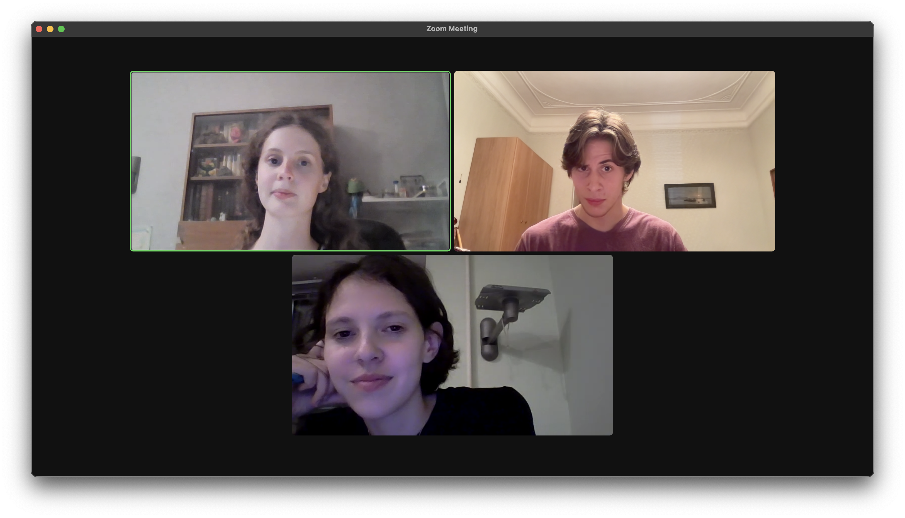

# Amino acid sequences analysis tool
This repository contains an open-source library which makes work with protein sequences clear. It is capable to process multiple proteins and peptides sequences, calculate physical features, find specific sites and easily handle with any protein encodings.

## Installation

To use this toolbox one need to clone repository

```shell
git clone https://github.com/PolinaVaganova/HW4_Functions2
cd HW4_Functions2
```

### System requirements:

Key packages and programs:
- [Python](https://www.python.org/downloads/) (version >= 3.9)

## Usage

```python
# import main function
from protein_analysis_tool import protein_analysis_tool
```      

## Operations

## get_seq_characteristic(seq)

Count entry of each residue type in your sequence

**Parameters:**
- **seq**: *str* 

input protein seq in 1-letter encoding and upper case

**Returns:**
- **res_count**: *dict*

each residue type in seq in 3-letter code and its amount in current seq

**Example**
```python
seq = 'AAA'
get_seq_characteristic(seq)
```

## find_res_in_seq(seq, res)

Find all positions of certain residue in your seq

**Parameters**:
- **seq**: *str* 

input protein seq in 1-letter encoding and upper case
- **res**: *str*

residue of interest in 1-letter encoding and upper case

**Returns:**
- **res_positions**: *str*

positions of specified residue in your seq

**Example**
```python
seq = 'AAA'
res = 'A'
find_res_in_seq(seq, res)
```

## find_site(seq, site)

Find if seq contains certain site and get positions of its site

**Parameters**:
- **seq**: *str* 

input protein seq in 1-letter encoding and upper case
- **site**: *str*

specify site of interest as short seq in 1-latter encoding

**Returns:**
- **site_positions**: *str*

positions of residues for each entry of specified site in your seq

**Example**
```python
seq = 'AAADDDF'
site = 'ADF'
find_site(seq, site)
```

## calculate_protein_mass(seq)

Get sum of residues masses in your seq in Da

**Parameters**:
- **seq**: *str* 

input protein seq in 1-letter encoding and upper case

**Returns:**
- **total_mass**: *float*

mass of all residues in seq in Da

**Example**
```python
seq = 'AAA'
calculate_protein_mass(seq)
```

## calculate_average_hydrophobicity(seq)

Get average hydrophobicity index for protein seq as sum of index for each residue in your seq divided by its length

**Parameters**:
- **seq**: *str* 

input protein seq in 1-letter encoding and upper case

**Returns:**
- **average_hydrophobicity_idx**: *float*

average hydrophobicity index for your seq

**Example**
```python
seq = 'AAA'
calculate_average_hydrophobicity(seq)
```

## get_mrna(seq)

Get encoding mRNA nucleotides for your seq

**Parameters**:
- **seq**: *str* 

input protein seq in 1-letter encoding and upper case

**Returns:**
- **mrna_seq**: *str*

potential encoding mRNA sequences with multiple choice for some positions

**Example**
```python
seq = 'AAA'
get_mrna(seq)
```

## calculate_isoelectric_point(seq)

Find isoelectrinc point as sum of known pI for residues in your seq

**Parameters**:
- **seq**: *str* 

input protein seq in 1-letter encoding and upper case

**Returns:**
- **pi**: *float*

isoelectric point for your seq

**Example**
```python
seq = 'AAA'
calculate_isoelectric_point(seq)
```

## run_protein_analysis(\*args)

Apply one of the operations described above to any number of sequences with any case. 

**Parameters**:
**\*args**:
- **sequences**: *str*

Input coma-separated sequences in 1-letter or 3-letter code with any case (as many as you wish)
- **add_arg**: *str*

Necessary parameter for certain functions (for example, specify target protein site)
- **procedure** : *str*

Specify procedure you want to apply

**Returns**
- **operation_result**: str or list

Result of function work in list or str format (dependent on number of input sequences)

**Note!**
- Operation name always must be the last argument
- Additional argument must be always before operation name


## Contact

*This is the repo for the 4th homework of the BI Python 2023 course*

Authors:
- *Grinberg Michael*
- *Grishenko Irina*
- *Vaganova Polina*

 

Issues and PRs are welcome